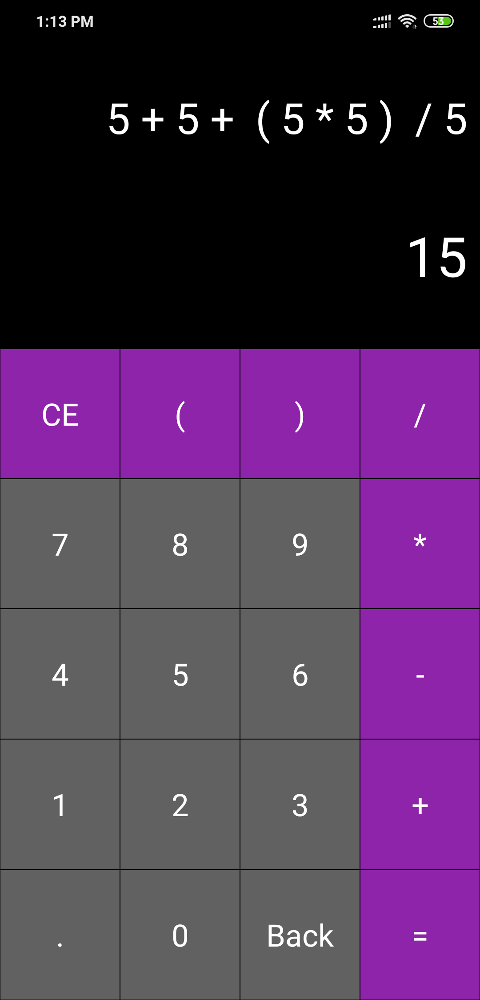

# Kotlin-Calculator
Kotlin Calculator is an simple calculator that performs various complex calculations with ease. This app is made in Kotlin on top of Android Platform. Fork, learn and use it for your projects.

## Screenshots:

## License: 
MIT (Do what you want. :P)
